# Meherr patient-matching trust audit

Date: 9 August 2026  
Scope: Mobile patient flow from scenario selection through appointment confirmation at `390 × 844`.

## Verdict

The interface is visually polished, concise and easy to move through, but the matching story is not credible yet. The prototype repeatedly presents clinician languages, travel times and static profile attributes as personalised match reasons even when the patient never supplied a language preference or starting location. That makes the product feel less like transparent matching and more like a scripted clinician gallery wearing a personalised label.

This is a P1 trust problem for a healthcare prototype. The aesthetic quality actually increases the risk because confident presentation makes unsupported inferences look authoritative.

## Evidence trail

1. The selected PCOS scenario asks for weight-respectful care but specifies no language.

   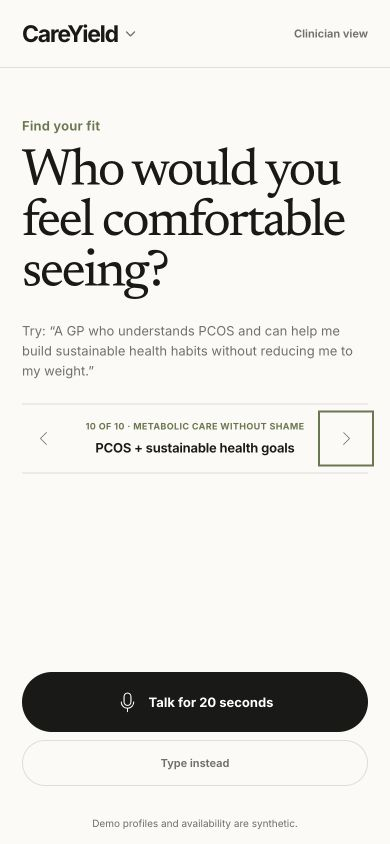

2. The voice screen appears to listen and count time, but completing it inserts the preset scenario text. It does not disclose that capture is simulated.

   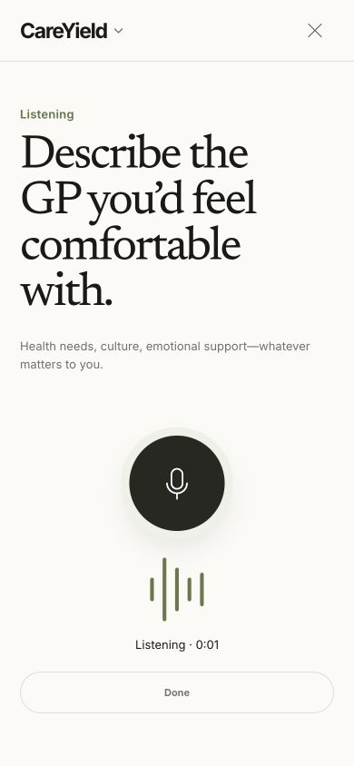

3. Review correctly shows PCOS, psychological safety, weight-respectful care and a woman GP. There is no language priority.

   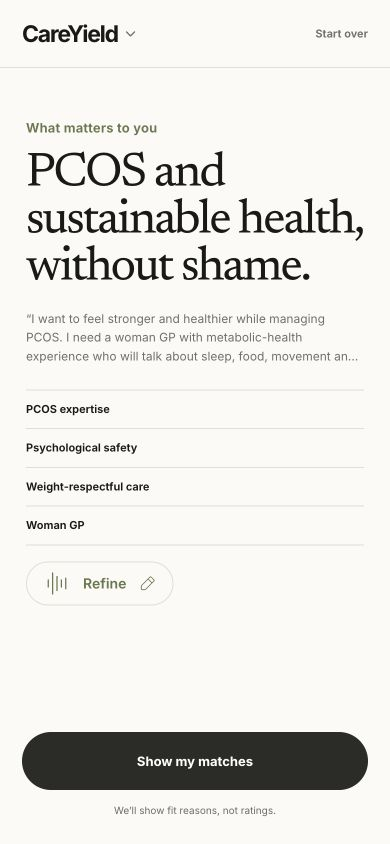

4. The result then says Spanish-language care is a reason for the match and claims a 12-minute walk, despite neither Spanish nor a starting location being supplied.

   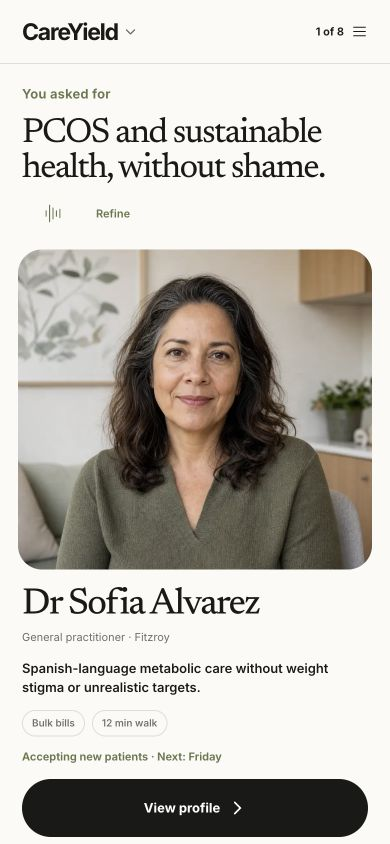

5. The profile labels gestational diabetes, PCOS and Spanish as “Why this fit.” Only PCOS is grounded in this request; the other items are static clinician attributes.

   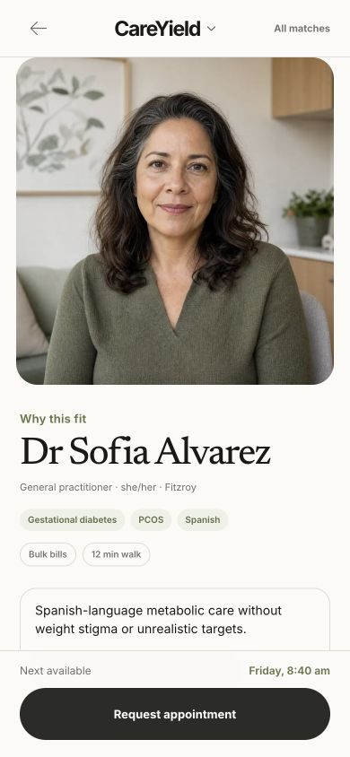

6. A custom gestational-diabetes request asks for a woman GP, calm explanations and maternity-team coordination. It contains no language or location.

   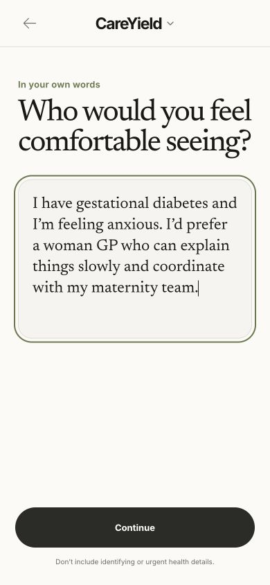

7. Review omits psychological safety even though the patient says she is anxious. The implementation recognises the literal word “anxiety,” not “anxious.”

   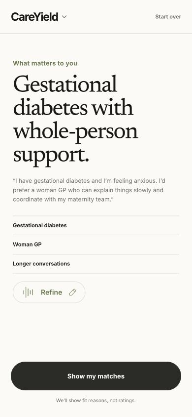

8. The result presents Arabic-language support and a 30-minute tram journey as personalised signals anyway.

   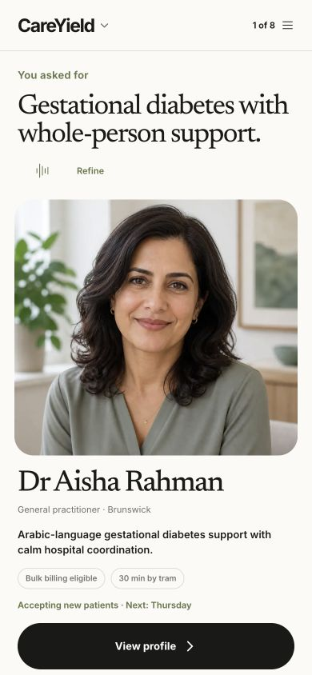

9. A disability-rights request with no language preference returns Vietnamese support and a 27-minute train journey as the principal match explanation.

   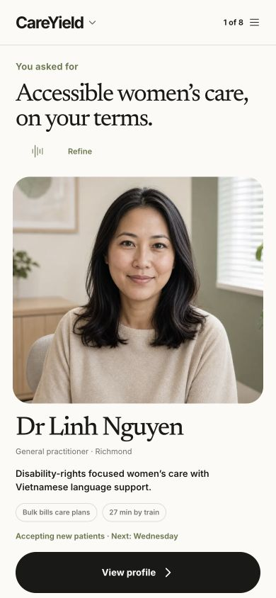

10. “Tailored for you” opens a list of eight clinicians, but rows show generic focus, billing and static travel data rather than request-relative fit or trade-offs.

   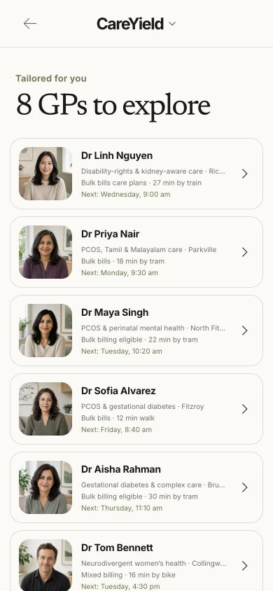

11. Booking is clean and understandable, but does not state appointment length, actual out-of-pocket cost, whether this appointment qualifies for bulk billing, or whether the requested access needs are supported for the selected time.

   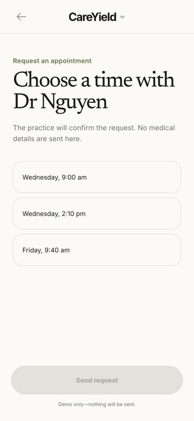

12. Confirmation has no practice contact method, request reference, expected response window or way to change/cancel the request.

   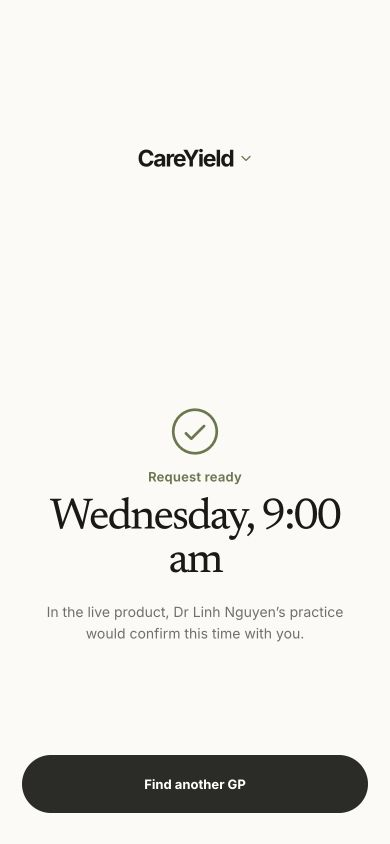

## Findings

### P1 — Match explanations are not grounded in the request

`matchLine`, `fitSignals` and `practicalSignals` are static clinician fields. The result and profile render them directly under “Why this fit,” so clinician facts are misrepresented as patient-specific reasons. Spanish, Arabic and Vietnamese appear regardless of whether those languages were requested.

Required change: build every displayed match reason from the intersection of explicit patient priorities and verified clinician capabilities. Unrequested attributes can remain under neutral headings such as “Also offers,” never “Why this fit.”

### P1 — Travel and proximity are fabricated

The flow never asks for a suburb, postcode or location permission, yet shows “12 min walk,” “27 min by train,” “30 min by tram,” and fixed distances. Billing is also presented without clarifying whether it applies to the proposed appointment.

Required change: ask for location or permission before showing travel. Until then, show only the practice suburb. Separate a practice’s billing policy from the patient’s likely price for the selected appointment.

### P1 — Voice capture performs a hidden substitution

The microphone screen visually implies live capture. Pressing Done ignores speech and inserts the current archetype’s preset request. A stakeholder could reasonably believe the prototype transcribed them.

Required change: label this state “Voice demo” and explicitly say a sample request will be inserted, or implement actual transcription. Repeat the privacy/urgent-care warning on the voice path; it currently appears only when typing.

### P1 — The interpreter is literal and lossy

Priority extraction and ranking use case-folded substring checks. This misses ordinary variants such as “anxious,” does not understand negation, and can accidentally match embedded fragments. The review looks intelligent but is not robust enough to support that claim.

Required change: for the MVP, use explicit chips/toggles after free text. Treat interpretation as a draft and let the patient add, remove or correct every priority before ranking.

### P1 — Accessibility needs are not carried into the appointment

“Wheelchair-accessible” affects the ranking, but the profile’s first two practical signals omit the clinic’s wheelchair-accessible attribute, and booking never reconfirms access. The most important constraint can disappear at the moment of conversion.

Required change: pin requested access constraints through result, profile and booking. Mark each one as confirmed, unknown or requiring practice confirmation.

### P1 — Sensitive capability claims have no provenance

Claims such as disability-rights focused, culturally responsive and trauma-aware are high-trust claims. The prototype does not say whether they come from clinician self-report, training, experience, patient feedback or platform verification.

Required change: attach a source and verification state to every sensitive capability. Do not imply quality or cultural safety from identity or language alone.

### P2 — The review step is editable only as a text block

The patient can edit the original prose, but cannot correct individual inferred priorities, mark something essential versus optional, or say “no language preference.” This is the exact point where the system should eliminate hidden assumptions.

Required change: show an editable interpretation with explicit values for language, clinician gender, cultural context, psychological support, access, billing, distance and availability. Every field needs “No preference” or “Not provided.”

### P2 — “All matches” lacks comparative meaning

The list is well laid out, but does not explain why the first clinician ranks above the second, which requested needs each clinician meets, or what the trade-offs are. Stable input-order ties can look like meaningful ranking.

Required change: show “meets 3 of 4 priorities” and a short, grounded trade-off. If confidence is low or several clinicians tie, say so.

### P2 — The matching animation overstates the computation

The fixed 4.25-second sequence says the system is considering clinical/cultural fit and checking access/availability, while the implementation performs a local keyword sort over static demo data. It has no skip control.

Required change: shorten it substantially, provide a reduced/instant path, and describe only the computation actually performed.

### P2 — Synthetic status fades out of the journey

The welcome screen says profiles and availability are synthetic, and booking says nothing will be sent, but the result/profile screens can be viewed or screenshotted without that context.

Required change: keep a quiet but persistent “Demo data” label on results, profiles and appointment times.

### P2 — Confirmation is not operationally complete

The final screen says the practice would confirm but provides no channel, timeframe, reference, change path or fallback.

Required change: show a request ID, practice contact channel, expected response window, and change/cancel action—even if clearly synthetic.

## What is working

- Strong visual hierarchy, generous spacing and low element density.
- Original request can be reviewed before matching.
- Billing, availability and access are treated as first-class concepts rather than buried profile details.
- Clinician profiles avoid star ratings and marketplace-style gamification.
- Buttons, radios, headings and live status messages have useful semantic structure in the inspected DOM.
- The demo navigation makes the patient, clinician and operations views easy to reach.

## Recommended MVP matching contract

1. Capture the patient’s own words.
2. Convert them into a draft set of structured preferences.
3. Require confirmation of language, location/travel, access, billing, clinician gender and psychological/cultural support; allow “No preference” and “Not provided.”
4. Rank only on explicit preferences and verified clinician capabilities.
5. Generate “Why this fits” from exact matched pairs and keep other clinician facts separate.
6. Carry essential constraints into booking and reconfirm anything unverified.
7. Show uncertainty, missing information and ties instead of filling gaps with plausible-sounding data.

## Accessibility and evidence limits

The inspected mobile flow has a strong visual hierarchy and broadly semantic controls, but this was not an exhaustive keyboard, screen-reader, contrast-ratio or assistive-technology test. Clinical accuracy, provider credential verification and real appointment integrations were also outside this audit. Findings are based on the current local demo, current-run screenshots, DOM inspection and implementation review.
